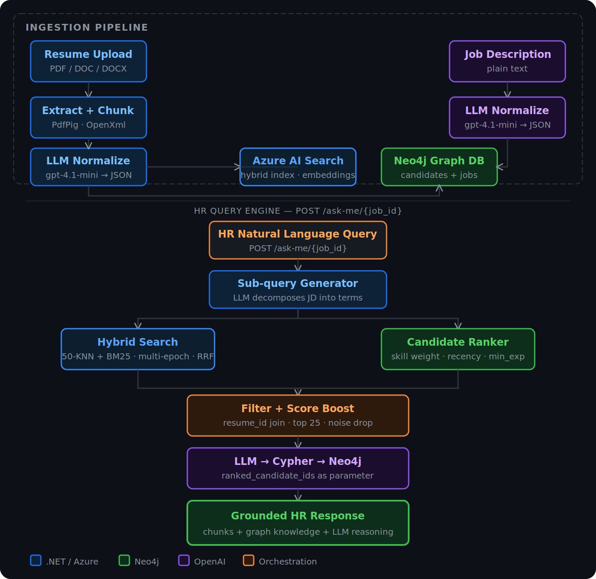
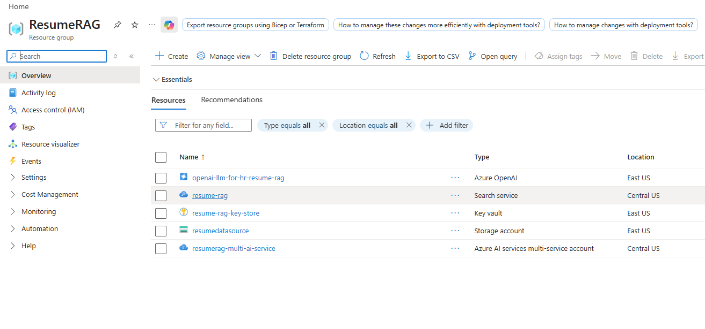
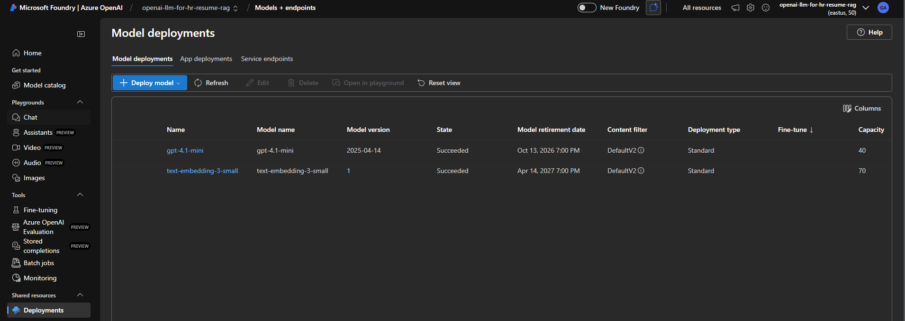
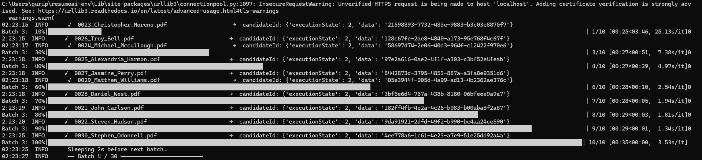
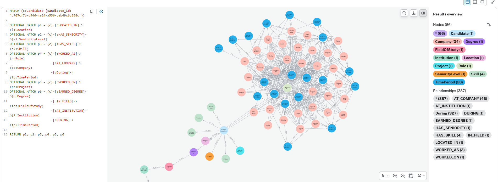
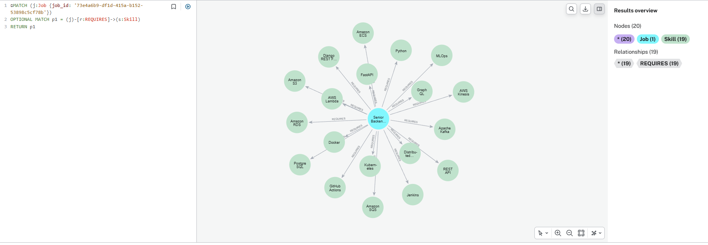
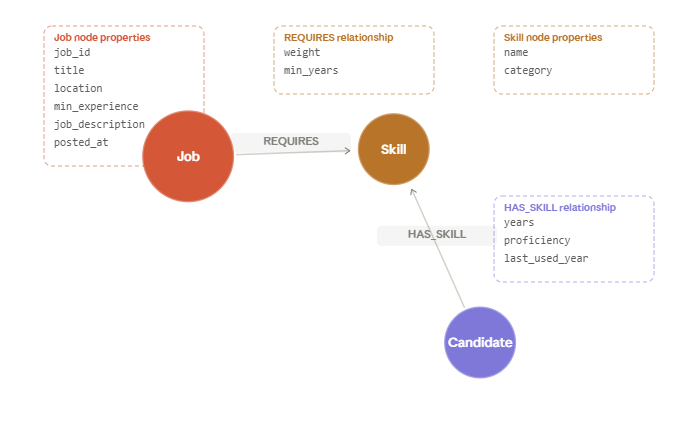
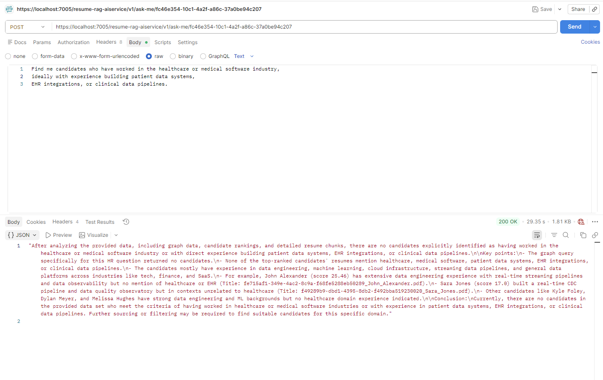
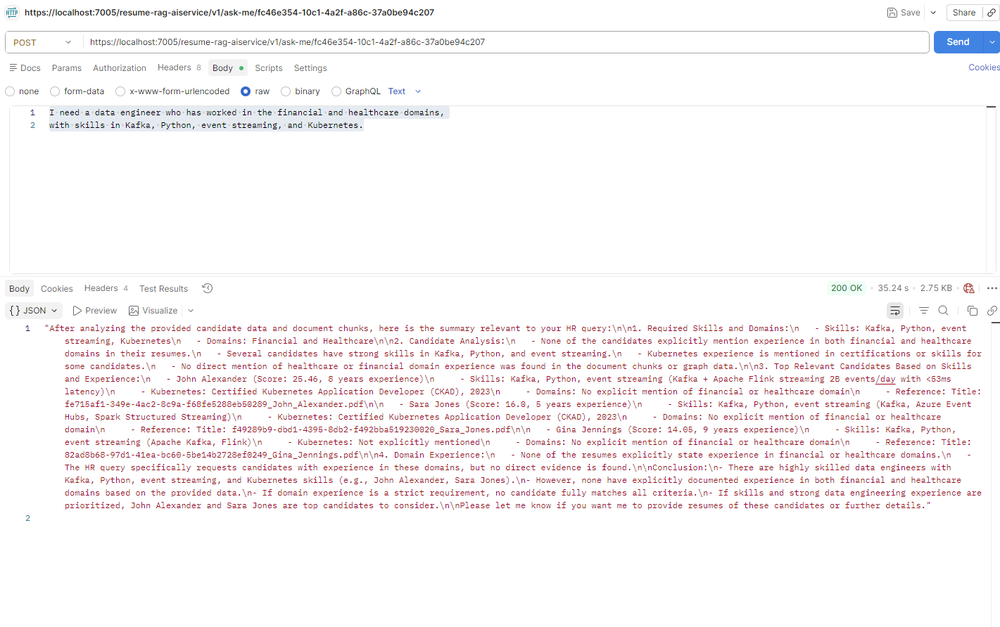
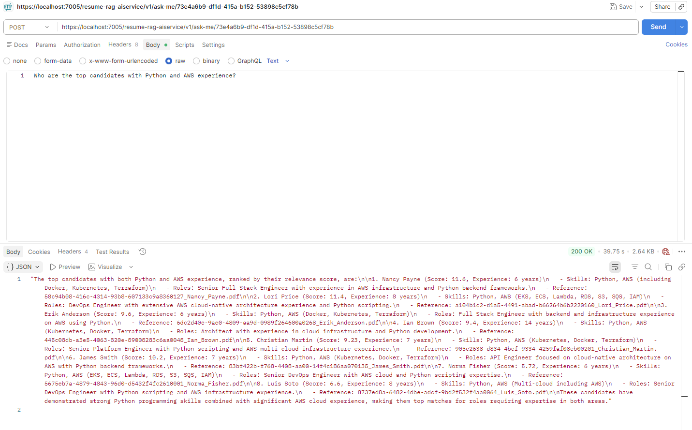

# ResumeAI — Hybrid RAG + Knowledge Graph Resume Screening

> A production-grade AI pipeline that enables HR teams to query thousands of resumes using natural language — grounded simultaneously in **Azure AI Search** (hybrid vector and keyword retrieval) and a **Neo4j knowledge graph** (structured candidate and job relationships). Built on .NET 8 with Azure PaaS services.

<br/>

[](https://dotnet.microsoft.com)
[](https://azure.microsoft.com/en-us/products/ai-services/openai-service)
[](https://neo4j.com)
[](https://azure.microsoft.com/en-us/products/ai-services/ai-search)
[](https://python.org)

<br/>

---

## The Problem

When a job posting receives thousands of applications, manually reviewing each resume is neither practical nor consistent. A human reviewer introduces fatigue and bias, and the process does not scale.

The obvious alternative — passing all resumes into a large language model — also fails at scale. Context windows are finite. Token costs scale linearly with input size. LLM attention degrades as context grows longer. And crucially, results are non-deterministic: the same question asked twice can produce a different ranking.

ResumeAI solves this by reframing resume screening as a **multi-store retrieval and filtering problem**. Every resume and job description is parsed into two complementary knowledge bases. When HR asks a question, the system applies structured relevance filtering across both stores before the LLM is involved — passing only the most relevant, job-specific context to the model. Token usage stays low, results stay accurate, and the same query always produces the same ranked output.

<br/>

---

## What You Can Ask

HR teams interact with the system through plain English. No query syntax, no filters, no form fields. Examples of real queries the system handles:

```
"I need a data engineer who has worked in the financial and healthcare domains,
 with skills in Kafka, Python, event streaming, and Kubernetes."

"Find candidates with experience building patient data systems,
 EHR integrations, or clinical data pipelines."

"Who are the top candidates with Python and AWS experience?"
```

The response for each query includes a ranked list of candidates with their relevance scores, matched skills with evidence, years of experience, role history, and direct references to the source resume file. If no candidates in the pool match the specific criteria, the system reports that honestly — it does not fabricate experience that is not present in the data.

<br/>

---

## Pipeline Architecture



The pipeline operates in two independent phases. **Ingestion** runs once per document and populates both knowledge bases. The **query engine** runs on demand for every HR question and draws from both stores to build a filtered, ranked context before invoking the LLM.

The diagram above illustrates how resumes and job descriptions enter through separate ingestion paths, how both Azure AI Search and Neo4j are populated with complementary representations of the same data, and how the query engine merges signals from both stores to progressively filter the candidate pool before the final LLM call.

<br/>

---

## Screenshots

<details>
<summary><strong>☁️ Azure Resource Group — provisioned infrastructure</strong></summary>
<br/>

All five Azure PaaS services are provisioned under a single resource group named `ResumeRAG`. This includes the Azure OpenAI resource (`openai-llm-for-hr-resume-rag`), the Azure AI Search service (`resume-rag`), Azure Key Vault (`resume-rag-key-store`) for secrets management, Azure Blob Storage (`resumedatasource`) for raw file storage, and an Azure AI Services multi-service account (`resumerag-multi-ai-service`).

The .NET 8 API itself runs locally and connects to these cloud services over HTTPS. No container or serverless deployment is included in this version.



</details>

---

<details>
<summary><strong>🤖 Azure OpenAI — model deployments</strong></summary>
<br/>

Two models are deployed under the Azure OpenAI resource `openai-llm-for-hr-resume-rag` in the East US region:

- **`gpt-4.1-mini`** (version `2025-04-14`, capacity 40) — handles every LLM task in the pipeline: resume normalization to structured JSON, job description normalization, semantic sub-query generation, Cypher query generation for Neo4j, and the final grounded HR response.
- **`text-embedding-3-small`** (version `1`, capacity 70) — generates dense vector embeddings for every resume chunk at ingestion time. These embeddings are stored alongside the text in Azure AI Search and used for vector similarity retrieval during queries.

Both deployments use the Standard deployment type with DefaultV2 content filtering.



</details>

---

<details>
<summary><strong>📥 Batch resume ingestion — 300 resumes processed in parallel</strong></summary>
<br/>

The Python automation script `bulk_upload_resumes.py` was used to upload 300 AI-generated resumes (produced using Claude Sonnet 4.6) to test the ingestion pipeline at scale. The script uses `ThreadPoolExecutor` to upload 10 resumes in parallel per batch, with a configurable 2-second sleep between batches to stay within Azure API rate limits.

Each line in the terminal output shows a resume filename, a checkmark on success, and the `candidateId` (a UUID) assigned to that candidate after Neo4j and AI Search have both been updated. The progress bar on the right shows per-batch timing — later batches run faster as the system reaches a steady state. Results are saved to `upload_results.json` for traceability.

The 300 resumes span a range of engineering roles, seniority levels, skill sets, and industries, providing a realistic test pool for evaluating query quality and ranking accuracy.



</details>

---

<details>
<summary><strong>🕸️ Neo4j — full candidate knowledge graph</strong></summary>
<br/>

This screenshot shows the Neo4j browser view of a single candidate node after the full ingestion pipeline has run. One candidate expands to **66 related nodes** connected by **387 relationships** across 11 node types: `Candidate`, `Skill` (4 nodes), `Role`, `Company` (34 nodes), `TimePeriod` (20 nodes), `Project`, `Degree`, `FieldOfStudy`, `Institution`, `Location`, and `SeniorityLevel`.

The Cypher query on the left side of the screenshot retrieves the full subgraph for a specific candidate using six optional match clauses — one for each relationship category. The graph view on the right shows the resulting node-link diagram, with blue nodes representing companies, pink nodes representing skills and roles, and teal nodes representing time periods.

This level of structured richness is what enables the graph to answer complex relational questions that keyword search cannot: not just "does this candidate know Kafka?" but "did they use Kafka professionally, at which companies, during which time periods, and at what proficiency level?"



</details>

---

<details>
<summary><strong>🏷️ Neo4j — job node with weighted skill requirements</strong></summary>
<br/>

This screenshot shows a job node for a **Senior Backend Engineer** role after the job description has been normalized and stored. The job node sits at the centre, connected to **19 `Skill` nodes** via `[:REQUIRES]` relationships. The skills visible in this graph include FastAPI, Python, Apache Kafka, Kubernetes, Docker, PostgreSQL, GitHub Actions, AWS Lambda, Amazon RDS, Amazon S3, Amazon SQS, Amazon ECS, Amazon Kinesis, AWS Kinesis, Django REST Framework, GraphQL, REST API, Jenkins, and Distributed Systems.

Every `[:REQUIRES]` relationship carries two properties: `weight` (how critical this skill is to the role, used to prioritise candidates who match high-weight skills) and `min_years` (the minimum years of experience the JD specifies for that skill). If the job description does not explicitly state a minimum experience requirement for a skill, `min_years` is stored as `null` — the LLM is instructed never to infer or estimate values that are not directly stated in the source text.

This job subgraph is the primary input to the candidate ranking step during a query. Every candidate in the pool is scored against this subgraph before any retrieval context is passed to the LLM.



</details>

---

<details>
<summary><strong>📐 Graph schema — the Job ↔ Skill ↔ Candidate relationship model</strong></summary>
<br/>

This diagram illustrates the core relationship pattern that connects job requirements to candidate qualifications through a shared `Skill` node. A `Job` node holds `[:REQUIRES]` relationships to each required `Skill`, with `weight` and `min_years` stored on the relationship itself. A `Candidate` node holds `[:HAS_SKILL]` relationships to the skills they possess, with `years`, `proficiency`, and `last_used_year` stored on those relationships.

Because both the job and the candidate connect to the same `Skill` nodes, the graph can directly compare what the role requires against what a candidate has — including recency (how recently the skill was used), depth (how many years), and level (proficiency). This is fundamentally different from keyword matching, which can only check whether a word appears in a document. The graph checks whether a candidate has used a specific skill in a professional context, for how long, and whether their experience meets the job's minimum threshold.



</details>

---

<details>
<summary><strong>🔍 Live HR query responses — three real examples against the same job</strong></summary>
<br/>

All three queries below were run against the same job (`job_id: 73e4a6b9-df1d-415a-b152-53898c5cf78b`) using the `POST /ask-me/{jobId}` endpoint. This demonstrates that the system scopes its candidate pool to the requirements of a specific job, not the full resume index.

---

**Query 1 — Healthcare domain with EHR and clinical data pipeline experience**

> *"Find me candidates who have worked in the healthcare or medical software industry, ideally with experience building patient data systems, EHR integrations, or clinical data pipelines."*

The system analyses the graph data and filtered resume chunks for the ranked candidate pool, then reports that **no candidates in the current dataset have explicitly documented healthcare or medical software industry experience**. Rather than returning loosely related candidates as substitutes, the response describes what the top-ranked candidates do offer — strong data engineering backgrounds in fintech and general tech — and explains clearly why they do not satisfy the specific domain requirement.

This behaviour is intentional and architecturally enforced. The LLM receives only the filtered context from Neo4j and AI Search. It cannot fabricate domain experience that is absent from both knowledge bases.



---

**Query 2 — Data engineer with Kafka, Python, event streaming, and Kubernetes**

> *"I need a data engineer who has worked in the financial and healthcare domains, with skills in Kafka, Python, event streaming, and Kubernetes."*

The system returns a ranked list of candidates with composite relevance scores. The top result, **John Alexander (score 25.46, 8 years of experience)**, is identified as having Kafka and Apache Flink streaming skills with a documented throughput of 2 billion events per day at under 53ms latency, alongside a Certified Kubernetes Application Developer (CKAD) certification from 2023. **Sara Jones (score 16.0, 5 years)** follows with Kafka, Azure Event Hubs, Spark Structured Streaming, and a CKAD certification. The response also notes that neither candidate has explicit documentation of financial or healthcare domain experience, distinguishing clearly between skill-fit and domain-fit.

Each candidate entry includes a direct reference to the source resume file by title, enabling the HR manager to pull the original document for further review.



---

**Query 3 — Top candidates with Python and AWS experience**

> *"Who are the top candidates with Python and AWS experience?"*

The system returns 8 ranked candidates. The top result, **Nancy Payne (score 11.6, 6 years)**, is listed as a Senior Full Stack Engineer with AWS infrastructure and Python backend experience covering Docker, Kubernetes, and Terraform. **Lori Price (score 11.4, 8 years)** follows as a DevOps Engineer with extensive AWS cloud-native coverage including EKS, ECS, Lambda, RDS, S3, SQS, and IAM. The response continues through all 8 candidates, each with their matched skills, role summary, years of experience, and resume file reference.



</details>

<br/>

---

## API Reference

The API runs on `.NET 8 Minimal API` and exposes three endpoints under the base path `resume-rag-aiservice/v1/`. Swagger UI is available at `https://localhost:7005/swagger` when running locally.

---

### `POST /upload-resume`

Accepts a resume file as `multipart/form-data`. Supported file types are PDF, DOC, and DOCX. The request must include either a `Transfer-Encoding: chunked` header or a `Content-Length` header — standard multipart clients such as Postman and curl handle this automatically.

**What happens when a resume is uploaded:**

**Step 1 — Blob storage.** The binary file is streamed directly to Azure Blob Storage without being buffered in the API process memory. This keeps the API lightweight regardless of file size.

**Step 2 — Text extraction.** PdfPig handles PDF files; DocumentFormat.OpenXml handles DOC and DOCX files. The extracted text is a raw string representation of the resume content, preserving all readable text while discarding formatting and layout.

**Step 3 — LLM normalisation.** The raw text is passed to `gpt-4.1-mini` with a structured system prompt that enforces a strict JSON output schema. The model extracts candidate name, email, total experience in years, location, seniority level, a list of skills (each with name, category, years of use, proficiency, and `last_used_year`), work history (each role with company name, industry, title, level, and time period), projects (with domain, complexity, and scale), and education (degree, field of study, institution, and time period). Any field not explicitly present in the resume text is set to `null` — the model is instructed not to infer or estimate missing values.

**Step 4 — Graph write.** The normalised JSON is written to Neo4j as a `Candidate` node with all associated relationship nodes created and linked: `Skill`, `Role`, `Company`, `TimePeriod`, `Project`, `Degree`, `FieldOfStudy`, `Institution`, `Location`, and `SeniorityLevel`. A `resume_id` value (composed of the file ID and filename) is stored on the `Candidate` node and serves as the cross-store join key.

**Step 5 — Search indexing.** The resume text is split into overlapping chunks. Each chunk is embedded using `text-embedding-3-small` to produce a dense vector representation. Both the vector and the original text are stored in Azure AI Search under the resume's `resume_id`, enabling hybrid retrieval during queries.

```json
// Success response
{ "candidateId": "21598893-7732-483e-9883-b3c03e8870f7" }
```

---

### `POST /post-job`

Accepts a plain-text job description in the request body with `Content-Type: text/plain`. Returns a `job_id` UUID that must be passed as a path parameter in all subsequent `/ask-me` calls associated with this role.

**What happens when a job description is posted:**

**Step 1 — LLM normalisation.** The raw job description text is passed to `gpt-4.1-mini`, which extracts a structured JSON object containing the job title, location, minimum experience in years, a semantically lossless natural-language summary of the role, and a list of required skills. Each skill in the list carries a `name`, `category`, `weight` (importance to the role on a normalised scale), and `min_years` (minimum years of experience required). The model is explicitly instructed to leave `min_experience` and `min_years` as `null` if they are not directly stated in the JD text — no inference is permitted.

**Step 2 — Graph write.** A `Job` node is created in Neo4j with the extracted properties. A `[:REQUIRES]` relationship is created from the `Job` node to each `Skill` node in the list, with `weight` and `min_years` stored as relationship properties. This job subgraph becomes the reference point for all candidate scoring during queries scoped to this `job_id`.

```json
// Success response
{
  "jobId": "73e4a6b9-df1d-415a-b152-53898c5cf78b",
  "status": "success",
  "message": "Job description normalized and persisted successfully."
}
```

---

### `POST /ask-me/{jobId}`

Accepts a natural language question in the request body. The `jobId` path parameter scopes the entire query pipeline — candidate ranking, Cypher generation, and context filtering all operate relative to the skill requirements stored in that job's Neo4j subgraph.

**The full 10-step query pipeline:**

| Step | Name | Description |
| :--: | :--- | :--- |
| 1 | **Job context retrieval** | The stored summarised job description is fetched from Neo4j for the given `job_id`. This gives the sub-query generator a structured understanding of the role's requirements, rather than relying solely on the HR's free-text question. |
| 2 | **Sub-query decomposition** | `gpt-4.1-mini` decomposes the job summary into a set of focused semantic sub-queries, each targeting a distinct search dimension: required skill clusters, preferred domain experience, expected seniority level, and role type. This decomposition ensures that no single intent dominates the retrieval pass. |
| 3 | **Parallel hybrid search** | Each sub-query is executed concurrently against Azure AI Search via `Task.WhenAll`. Each search run uses both BM25 keyword scoring and vector similarity search with **50-KNN** (see Engineering Decisions). The results from both modalities are merged per sub-query using Reciprocal Rank Fusion, which reranks results by combining the keyword and vector rank positions into a single normalised score. |
| 4 | **Chunk frequency mapping** | All retrieved chunks across all sub-queries are grouped by `{chunk_id, resume_id}`. Each chunk is assigned a frequency score based on how many distinct sub-queries returned it. A chunk that surfaces in five out of six sub-queries carries a much stronger multi-dimensional relevance signal than one that appeared in only one. |
| 5 | **Graph-side candidate ranking** | Independently of the search retrieval, Neo4j scores every candidate in the pool against the job's `[:REQUIRES]` subgraph. The scoring formula considers: the proportion of required skills the candidate possesses, the `weight` of each matched skill, how recently each skill was used (`last_used_year` on `[:HAS_SKILL]`), and proficiency level. The top 25 candidates by composite graph score are returned as `ranked_candidates`. |
| 6 | **Cross-store noise filtering** | The chunk frequency map from Step 4 is filtered to retain **only** chunks whose `resume_id` maps to one of the 25 candidates returned in Step 5. All other chunks — regardless of how semantically similar they may be to the query — are discarded at this point. This is the primary mechanism for keeping the LLM's context window clean, lean, and relevant to the specific job. |
| 7 | **Score combination and re-ranking** | Each retained candidate receives a final combined score: their chunk frequency score (Step 4) is added to their graph rank score (Step 5). Candidates are re-ranked by this combined score to produce the final ordered list passed to the LLM. |
| 8 | **LLM Cypher generation** | The HR's original natural language question is passed to `gpt-4.1-mini` alongside the `ranked_candidate_ids` list from Step 7. The model generates Cypher queries for Neo4j parameterised with these specific candidate IDs. The parameterisation is a hard boundary — the LLM cannot construct queries that retrieve graph data for candidates outside the filtered pool. |
| 9 | **Graph knowledge retrieval** | Neo4j executes the generated Cypher and returns rich relational data scoped to the ranked candidates: full work history with employer names and time periods, contextualised skill usage, project details, education records, and certifications. |
| 10 | **Grounded LLM response** | A final call to `gpt-4.1-mini` receives the HR's original question, the filtered resume chunks from Azure AI Search, the graph knowledge from Neo4j, and the candidate rankings with scores. The model produces a structured, reasoned, and cited response based solely on this filtered context — it cannot draw on general training knowledge to supplement missing information. |

> **On result consistency across repeated requests:** The input to Step 10 is fully deterministic for a fixed dataset state. The same `job_id` always retrieves the same stored JD summary, which always produces the same sub-queries, which always retrieve the same chunks from an unchanged AI Search index. The same Neo4j graph state always produces the same top-25 candidate scores. With identical filtered inputs, the LLM response converges across runs — even though the model itself is probabilistic.

<br/>

---

## Graph Schema

### Candidate subgraph

The following schema is built for every resume ingested. Each node type is stored as a separate Neo4j label. Relationship properties carry the metadata needed for ranking and retrieval.

```cypher
(Candidate {candidate_id, full_name, email, total_experience_years, resume_id, last_updated})
  -[:LOCATED_IN]-->    (Location {city, state, country})
  -[:HAS_SENIORITY]--> (SeniorityLevel {name})
  -[:HAS_SKILL]------> (Skill {name, category})
                          relationship: {years, proficiency, last_used_year}
  -[:WORKED_AS]------> (Role {title, level})
                          -[:AT_COMPANY]--> (Company {name, industry})
                          -[:DURING]------> (TimePeriod {from_date, to_date})
  -[:WORKED_ON]------> (Project {project_id, name, domain, complexity, scale})
  -[:EARNED_DEGREE]--> (Degree {name})
                          -[:IN_FIELD]---------> (FieldOfStudy {name})
                          -[:AT_INSTITUTION]--> (Institution {name})
                          -[:DURING]----------> (TimePeriod {from_date, to_date})
```

### Job subgraph

The following schema is built for every job description posted.

```cypher
(Job {job_id, title, location, min_experience, job_description, posted_at})
  -[:REQUIRES]--> (Skill {name, category})
                    relationship: {weight, min_years}
```

> **The cross-store join key:** The `resume_id` property on the `Candidate` node is set to `fileID_fileName` at ingestion time. This same value is stored on every AI Search chunk belonging to that resume. During Step 6 of the query pipeline, the system uses this key to filter the chunk frequency map to only those chunks whose `resume_id` appears in the Neo4j-ranked top-25 list. Without this join key, cross-store noise filtering would not be possible.

<br/>

---

## Tech Stack

| Layer | Technology | Version |
| :--- | :--- | :---: |
| API and orchestration | .NET Minimal API | 8.0 |
| LLM reasoning and generation | Azure OpenAI — `gpt-4.1-mini` | `2025-04-14` |
| Vector embeddings | Azure OpenAI — `text-embedding-3-small` | `1` |
| Hybrid vector and keyword search | Azure AI Search | SDK 11.7.0 |
| Knowledge graph storage and querying | Neo4j | Driver 6.0.0 |
| Raw file storage | Azure Blob Storage | — |
| Secrets management | Azure Key Vault | — |
| Multi-service AI account | Azure AI Services | — |
| PDF text extraction | PdfPig | 0.1.13 |
| DOCX text extraction | DocumentFormat.OpenXml | 3.4.1 |
| Batch automation | Python 3 with `requests`, `tqdm`, `concurrent.futures` | 3.10+ |

<br/>

---

## Project Structure

```
ResumeAI/
├── ResumeAI.RagwithGraph.Api/
│   ├── Endpoints/
│   │   └── FileEndpoints.cs                     # Route definitions for all three endpoints
│   ├── Services/
│   │   ├── Declaration/                         # Interface contracts
│   │   │   ├── IAISearchService.cs              # Hybrid search and indexing operations
│   │   │   ├── ILLMAdapterService.cs            # All LLM call abstractions
│   │   │   ├── INeo4jGraphService.cs            # Graph read and write operations
│   │   │   └── IResumeLLMOrchestrationService.cs  # Full pipeline coordination
│   │   └── Implementation/                      # Service logic
│   │       ├── AISearchService.cs
│   │       ├── LLMAdapterService.cs
│   │       ├── Neo4jGraphService.cs
│   │       └── ResumeLLMOrchestrationService.cs
│   ├── Repository/
│   │   └── Implementation/
│   │       ├── Neo4jGraphRepo.cs                # Raw Cypher execution layer
│   │       └── ResumeTextExtractor.cs           # PDF and DOCX text extraction
│   ├── Model/
│   │   ├── ResumeGraphNormalizationResult.cs    # C# model matching the candidate JSON schema
│   │   ├── JobNormalizationResult.cs            # C# model matching the job JSON schema
│   │   └── RankedCandidateResult.cs             # Output model for ranked candidate results
│   ├── Utility/
│   │   ├── LLMSystemMessages.cs                 # All LLM system prompt constants
│   │   └── MultipartRequestHelper.cs
│   └── AutomationScripts/
│       ├── bulk_upload_resumes.py               # Parallel batch resume ingestion script
│       └── upload_job_descriptions.py           # Batch job description upload script
└── ResumeAI.RagwithGraph.Common/
    ├── BlobStorageService.cs
    └── Model/
        ├── ApiError.cs
        ├── FileUploadResponse.cs
        └── Responses.cs
```

<br/>

---

## Setup

### Prerequisites

- .NET 8 SDK
- Python 3.10 or later (required only for the automation scripts)
- Neo4j Desktop (local development) or Neo4j AuraDB (cloud)
- An active Azure subscription with the following resources provisioned:
  - Azure OpenAI resource with `gpt-4.1-mini` and `text-embedding-3-small` deployed
  - Azure AI Search service (Standard tier or above is recommended for production-scale indexing)
  - Azure Blob Storage account with a dedicated container for resume files
  - Azure Key Vault for secrets management
  - Azure AI Services multi-service account

### Configuration

Add the following block to `appsettings.Development.json`. For production use, store each value as a secret in Azure Key Vault and reference it via the Key Vault configuration provider.

```json
{
  "AzureOpenAI": {
    "Endpoint": "https://<your-resource-name>.openai.azure.com/",
    "ApiKey": "<your-api-key>",
    "ChatDeploymentName": "gpt-4.1-mini",
    "EmbeddingDeploymentName": "text-embedding-3-small"
  },
  "AzureAISearch": {
    "Endpoint": "https://<your-search-name>.search.windows.net",
    "ApiKey": "<your-admin-key>",
    "IndexName": "resume-index"
  },
  "AzureBlobStorage": {
    "ConnectionString": "<your-connection-string>",
    "ContainerName": "resumes"
  },
  "Neo4j": {
    "Uri": "bolt://localhost:7687",
    "Username": "neo4j",
    "Password": "<your-password>"
  }
}
```

### Running the API

```bash
cd ResumeAI.RagwithGraph.Api
dotnet run

# Swagger UI is available at:
# https://localhost:7005/swagger
```

<br/>

---

## Automation Scripts

### Bulk resume ingestion — `bulk_upload_resumes.py`

This script was used to ingest 300 test resumes into the pipeline. It uploads files in configurable parallel batches and records the result of each upload.

```bash
pip install requests tqdm

# Configure the following at the top of the script before running:
#   BASE_URL              = "https://localhost:7005"
#   RESUME_FOLDER         = "path/to/your/resume/folder"
#   BATCH_SIZE            = 10    # number of parallel uploads per batch
#   DELAY_BETWEEN_BATCHES = 2     # seconds to wait between batches

python AutomationScripts/bulk_upload_resumes.py

# Output:  upload_results.json
# Format:  { "file": "...", "candidateId": "...", "status": "success" }
#          one entry per resume processed
```

The script uses `ThreadPoolExecutor` to upload each batch in parallel, then sleeps before the next batch to respect Azure API rate limits. Failed uploads are captured in the output file rather than halting the entire run, allowing partial re-runs without duplicating successful uploads.

---

### Batch job description upload — `upload_job_descriptions.py`

This script processes a plain-text file containing multiple job descriptions and posts each one to the API.

**Job descriptions file format:**

```
LABEL: Senior Data Engineer
---
We are looking for a Senior Data Engineer with a minimum of 5 years of experience
in distributed data systems and real-time streaming architectures...
<continue full job description text>
===
LABEL: Senior Backend Software Engineer
---
We are seeking a Backend Software Engineer with deep expertise in distributed
systems, microservices architecture, and cloud-native development...
<continue full job description text>
===
```

```bash
# Configure JD_FILE and BASE_URL in the script before running
python AutomationScripts/upload_job_descriptions.py

# Output:  job_ids.json
# Format:  { "label": "...", "job_id": "..." }
#          one entry per successfully posted job description
#
# The job_id values in this file are what you pass to POST /ask-me/{jobId}
```

<br/>

---

## Engineering Decisions

<details>
<summary><strong>Why use 50-KNN instead of the Azure AI Search default of 10?</strong></summary>
<br/>

Azure AI Search defaults to retrieving 10 nearest neighbours for vector search. In a hybrid search scenario where both BM25 and vector search run in parallel, a chunk that ranks first on keyword relevance may not appear anywhere in the top 10 for vector similarity — and vice versa. This asymmetry becomes significant when running multiple sub-queries across a large index, because relevant chunks from minority search intents can easily be missed if the KNN window is too narrow.

Expanding to 50 nearest neighbours per sub-query ensures that both modalities have sufficient coverage to represent their respective rankings before Reciprocal Rank Fusion merges them. The improvement in recall is meaningful for complex multi-intent queries, and the additional compute cost is acceptable given that all sub-queries run concurrently.

</details>

<details>
<summary><strong>Why decompose the HR query into multiple sub-queries rather than running a single search?</strong></summary>
<br/>

A natural language HR query typically contains several distinct search intents compressed into a single sentence. A query such as "data engineer with Kafka and Kubernetes experience in fintech" contains at least three separable dimensions: a skill cluster (Kafka, Kubernetes), a domain (fintech), and a role type (data engineer). Running a single embedding-based search against this compound query allows the dominant intent — usually the most prominent noun phrase — to overshadow the others in the embedding space.

Decomposing the job description summary into focused sub-queries and scoring chunks by how many distinct sub-queries they appear in produces a multi-dimensional relevance signal. A chunk retrieved by five out of six sub-queries is far more likely to be genuinely relevant to the role than a chunk that happened to be the top result for only one of them. This frequency-based scoring is also what allows the system to distinguish between a candidate who is broadly relevant and one who genuinely covers the full requirement profile.

</details>

<details>
<summary><strong>Why use Neo4j for candidate ranking rather than relying entirely on AI Search?</strong></summary>
<br/>

Azure AI Search is highly effective at retrieving semantically similar text, but it has no awareness of the job posting, its required skills, their relative importance, or the minimum experience thresholds specified by HR. A search that returns "resume chunks similar to the query text" is fundamentally different from "candidates who meet the requirements of this specific role."

Scoring candidate suitability for a role requires relational reasoning that a search index cannot perform: does this candidate have the required skill? For how many years? How recently did they use it? Does their experience meet the minimum threshold? These are graph traversal questions answered directly by the `[:REQUIRES]` and `[:HAS_SKILL]` relationship metadata stored in Neo4j. The graph returns a deterministic, weighted score for each candidate relative to a specific job — something that is not achievable through text similarity alone.

</details>

<details>
<summary><strong>Why is cross-store noise filtering the central architectural constraint?</strong></summary>
<br/>

In a naive RAG implementation over 10,000 resumes, AI Search will return many chunks from candidates who are semantically similar to the query text but fundamentally unsuited to the specific role. Passing this unfiltered context to the LLM wastes tokens on irrelevant candidates, increases cost proportionally, and risks diluting the model's attention across noise rather than concentrating it on the genuinely relevant candidates.

The cross-store filter — retaining only chunks whose `resume_id` maps to the Neo4j-ranked top-25 candidates — is the mechanism that resolves this. It combines the semantic breadth of AI Search (which surfaces broadly relevant content) with the structured precision of the graph (which scores role-specific fit) to produce a context window that is both semantically rich and role-specifically filtered. The LLM then reasons over a small, high-quality context rather than a large, noisy one — which is the condition under which language models perform best.

</details>

<details>
<summary><strong>Why generate Cypher queries dynamically with the LLM rather than using predefined query templates?</strong></summary>
<br/>

Predefined Cypher templates can answer a fixed set of questions — "who has skill X?", "who worked at company Y?" — but they cannot accommodate the open-ended, combinatorial nature of real HR questions. A question like "who used Kafka in a fintech company between 2021 and 2024, holds a CKAD certification, and has more than three years of Python experience?" requires a Cypher query that joins skills, companies, time periods, and certifications simultaneously. Writing templates for every possible combination is not feasible.

LLM-generated Cypher, parameterised with `ranked_candidate_ids`, provides the flexibility to answer arbitrary relational questions while enforcing a hard boundary: the generated queries can only retrieve data for the candidates already approved by the graph ranker. This ensures that the LLM's ability to construct novel queries does not introduce scope creep into the candidate pool.

</details>

<br/>

---

## Roadmap

- [ ] Streaming responses on `/ask-me` via Server-Sent Events for progressive output rendering
- [ ] Cloud deployment on Azure Container Apps
- [ ] Resume deduplication and graph node update handling on re-upload
- [ ] Learned score weighting model to calibrate the chunk frequency and graph rank combination
- [ ] HR-facing candidate visualisation dashboard
- [ ] Skill taxonomy normalisation to merge equivalent terms (`K8s` → `Kubernetes`, `JS` → `JavaScript`)
- [ ] Multi-language resume support

<br/>

---

## About This Project

This is a personal project built to explore practical applications of hybrid RAG architecture, knowledge graph integration, and LLM grounding techniques using Azure PaaS services. It is not affiliated with or endorsed by any employer.

The 300 test resumes used during development were synthetically generated using Claude Sonnet 4.6 and do not represent real individuals.

Source code and discussion are available on this repository. Feedback, questions, and contributions are welcome via GitHub Issues.
